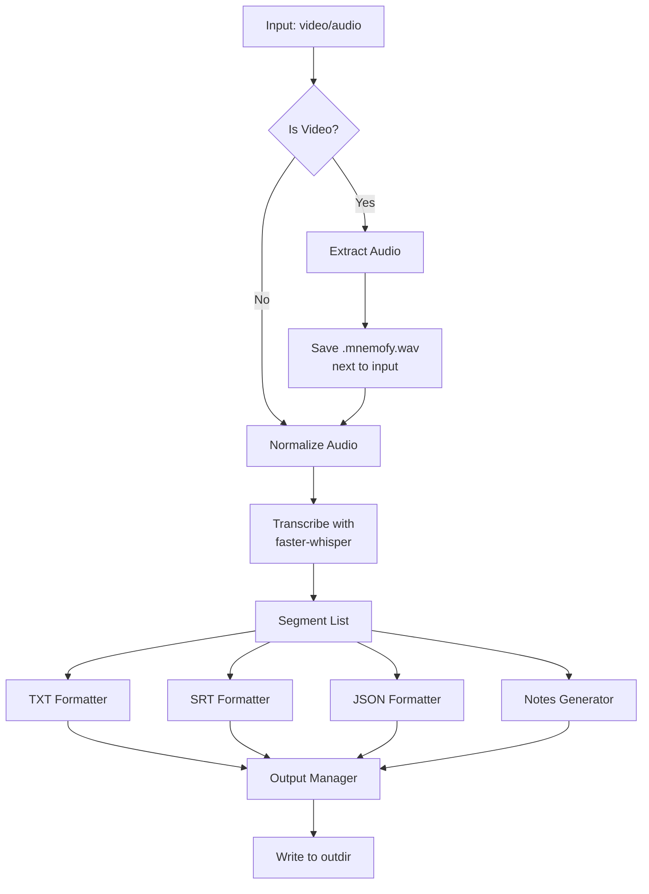

# Implementation Plan: Enhanced Output Formats and Pipeline

**Feature**: 002-enhanced-output-formats  
**Target Version**: 0.8.0  
**Estimated Timeline**: 5-7 weeks (40-50 hours)

---

## Planning Summary

This feature implements the complete output management system from the detailed specification, adding multi-format transcript generation, automatic audio extraction, and structured notes with timestamps.

### Key Deliverables
1. **Output Manager**: Centralized path management for all artifacts
2. **Tri-Format Transcripts**: TXT, SRT, JSON formatters
3. **Structured Notes**: 7-section MD with timestamp citations
4. **CLI Enhancements**: --outdir, --lang, --notes flags
5. **Audio Extraction**: Auto-extract from video, save next to input

---

## Architecture Overview

### New Modules

```
src/mnemofy/
├── output_manager.py      # Output path management (NEW)
├── formatters.py          # TXT/SRT/JSON formatters (NEW)
├── notes.py                # Enhanced notes generator (MAJOR REFACTOR)
├── audio.py                # Audio extractor (ENHANCE)
└── cli.py                  # CLI integration (UPDATE)

tests/
├── test_output_manager.py  # Output path tests (NEW)
├── test_formatters.py       # Format validation tests (NEW)
├── test_notes_enhanced.py   # Notes extraction tests (NEW)
├── test_audio_extract.py    # Audio extraction tests (UPDATE)
└── test_cli_outputs.py      # Integration tests (NEW)
```

### Data Flow



---

## Implementation Phases

### Phase 1: Foundation - Output Manager (6-8 hours)

**Goals**:
- Create `OutputManager` class for path management
- Handle --outdir flag logic
- Implement audio save-next-to-input behavior

**Tasks**:
- T-001: Create `output_manager.py` module
- T-002: Implement path generation methods
- T-003: Add --outdir CLI flag
- T-004: Write unit tests for path logic
- T-005: Update audio extractor to use OutputManager

**Deliverable**: Centralized output path management working

---

### Phase 2: Transcript Formatters (8-10 hours)

**Goals**:
- Implement TXT formatter with timestamps
- Implement SRT formatter (SubRip spec compliant)
- Implement JSON formatter with metadata
- Ensure format consistency across all three

**Tasks**:
- T-006: Create `formatters.py` module structure
- T-007: Implement TXT formatter (`[HH:MM:SS–HH:MM:SS] text`)
- T-008: Implement SRT formatter (sequence, timing, text)
- T-009: Implement JSON formatter (segments + metadata)
- T-010: Add format validation utilities
- T-011: Write comprehensive formatter tests (30+ tests)
- T-012: Validate SRT in subtitle editors

**Deliverable**: Three transcript formats generating correctly

---

### Phase 3: Enhanced Notes Generation (12-15 hours)

**Goals**:
- Refactor notes.py for structured output
- Implement 7 required sections
- Extract topics, decisions, actions with timestamps
- Implement basic (deterministic) mode
- Stub LLM mode for future

**Tasks**:
- T-013: Refactor `NoteGenerator` to `StructuredNotesGenerator`
- T-014: Implement metadata section generator
- T-015: Implement topic extraction with time ranges
- T-016: Implement decision extraction with timestamps
- T-017: Implement action item extraction (owner + timestamp)
- T-018: Implement concrete mentions extraction (names, URLs, numbers)
- T-019: Implement risks/open questions extraction
- T-020: Add transcript file links section
- T-021: Implement --notes basic mode (deterministic)
- T-022: Stub --notes llm mode (future)
- T-023: Write notes extraction tests (25+ tests)

**Deliverable**: Structured notes with all sections and timestamps

---

### Phase 4: CLI Integration (4-6 hours)

**Goals**:
- Add new CLI flags
- Integrate all formatters and notes generator
- Orchestrate complete pipeline
- Maintain backward compatibility

**Tasks**:
- T-024: Add --lang flag to CLI
- T-025: Add --notes flag to CLI (basic|llm)
- T-026: Integrate OutputManager in transcribe command
- T-027: Call all three formatters after transcription
- T-028: Integrate enhanced notes generator
- T-029: Add format summary logging
- T-030: Write CLI integration tests (10+ tests)

**Deliverable**: Complete CLI with all features working

---

### Phase 5: Testing & Validation (6-8 hours)

**Goals**:
- Comprehensive unit test coverage (90%+)
- Integration tests for full pipeline
- Format validation (SRT, JSON)
- Real-world testing with diverse media

**Tasks**:
- T-031: Achieve 90%+ coverage in output_manager.py
- T-032: Achieve 90%+ coverage in formatters.py
- T-033: Achieve 90%+ coverage in enhanced notes.py
- T-034: Write end-to-end integration tests
- T-035: Test with real video files (mp4, mkv, mov)
- T-036: Validate SRT files in VLC/subtitle editors
- T-037: Validate JSON format with parsers
- T-038: Test --outdir with various path types
- T-039: Test --lang with non-English audio
- T-040: Edge case testing (large files, exotic codecs)

**Deliverable**: 90%+ test coverage, validated formats

---

### Phase 6: Documentation (3-4 hours)

**Goals**:
- Update README with new features
- Document all output formats
- Provide usage examples
- Update CHANGELOG

**Tasks**:
- T-041: Add "Output Files" section to README
- T-042: Document --outdir, --lang, --notes flags
- T-043: Provide format examples (TXT, SRT, JSON, MD)
- T-044: Add troubleshooting for audio extraction issues
- T-045: Update CHANGELOG for v0.8.0
- T-046: Add docstrings to all new code
- T-047: Create examples directory with sample outputs

**Deliverable**: Comprehensive documentation

---

### Phase 7: Release (2-3 hours)

**Goals**:
- Bump version to 0.8.0
- Final validation
- Publish to PyPI

**Tasks**:
- T-048: Bump version in pyproject.toml
- T-049: Final integration test run
- T-050: Test installation from source
- T-051: Build distribution
- T-052: Upload to PyPI
- T-053: Tag v0.8.0 release
- T-054: Push to remote

**Deliverable**: mnemofy v0.8.0 published

---

## Risk Management

### High-Priority Risks

**R1: SRT Format Compatibility**
- Risk: Generated SRT files don't work in subtitle editors
- Mitigation: Strict adherence to SubRip spec, test in 3+ editors
- Owner: Phase 2

**R2: Audio Extraction Failures**
- Risk: ffmpeg fails on exotic video codecs
- Mitigation: Comprehensive error handling, clear user messages, test diverse formats
- Owner: Phase 1

**R3: Notes Hallucination (Basic Mode)**
- Risk: Even basic mode might extract incorrect information
- Mitigation: Conservative extraction, timestamp requirements, extensive testing
- Owner: Phase 3

**R4: Backward Compatibility Break**
- Risk: Existing users' scripts break
- Mitigation: Maintain defaults, make new flags optional, regression tests
- Owner: Phase 4

---

## Dependencies

### Technical Prerequisites
- Feature 001 (Adaptive ASR) must be complete ✓
- ffmpeg installed and working ✓
- faster-whisper integration working ✓

### External Dependencies
- None (all dependencies already in place)

### Team Dependencies
- User feedback on notes format preferred structure
- Example real-world meeting recordings for testing

---

## Success Metrics

### Functional Metrics
- ✓ 100% of video inputs extract audio successfully
- ✓ 100% of transcriptions produce 4 output files (TXT+SRT+JSON+MD)
- ✓ 100% of notes sections cite timestamps
- ✓ 0% hallucinated information in basic mode

### Quality Metrics
- ✓ 90%+ test coverage
- ✓ SRT files validated in 3+ subtitle editors
- ✓ JSON validated with Python json.loads()
- ✓ No regressions in existing features

### Performance Metrics
- ✓ Format conversion adds <5% to total pipeline time
- ✓ Audio extraction completes in <10% of video duration
- ✓ Notes generation completes in <30 seconds for 1hr audio

---

## Timeline Estimate

| Phase | Duration | Start After | Critical Path |
|-------|----------|-------------|---------------|
| Phase 1: Output Manager | 6-8 hours | Immediate | Yes |
| Phase 2: Formatters | 8-10 hours | Phase 1 | Yes |
| Phase 3: Notes Generator | 12-15 hours | Phase 2 | Yes |
| Phase 4: CLI Integration | 4-6 hours | Phase 3 | Yes |
| Phase 5: Testing | 6-8 hours | Phase 4 | Yes |
| Phase 6: Documentation | 3-4 hours | Phase 5 | No (can parallelize) |
| Phase 7: Release | 2-3 hours | Phase 5+6 | Yes |

**Total**: 40-50 hours over 5-7 weeks (assuming 8-10 hours/week)

---

## Rollout Strategy

### v0.8.0-alpha (After Phase 3)
- Internal testing build
- Validate formatters and notes quality
- Gather feedback on notes structure

### v0.8.0-beta (After Phase 5)
- Public beta release
- Invite users to test with real recordings
- Collect format compatibility reports

### v0.8.0 (After Phase 7)
- Full production release
- PyPI publication
- Announcement to users

---

## Next Steps

1. **Review this plan** with stakeholders
2. **Create feature branch**: `002-enhanced-output-formats`
3. **Begin Phase 1**: Output Manager implementation
4. **Set up CI** to test all formats automatically

**Ready to proceed?** See [tasks.md](./tasks.md) for detailed task breakdown.
